 
  

## **💌 서비스 소개**

`기억함`을 통해 소중한 추억을 보관하고 회상해보세요. 기억은 글, 이미지, 동영상, 오디오로 저장할 수 있습니다. 또한 혼자나 친구, 지인들과 기억함을 공유할 수 있습니다.

 

### **개요**

- [개발기간](#개발기간)
- [팀원정보](#팀원정보)
- [기획의도](#기획의도)
- [아키텍처](#아키텍처)
- [UI 설계](#ui-설계)
- [DB 설계](#db-설계)
- [기능소개](#기능소개)
  - 메인페이지
  - 생성페이지
  - 등록페이지
  - 내기억함페이지
  - 유저준비페이지
  - 오픈페이지
  - 상세보기페이지
  - 마이페이지
  - 보물찾기페이지

 
 

## **서비스 기획**

### 개발기간

**2022.04.11 ~ 2022.05.20 (6주)**

 

### **팀원정보**

| 👑박동준 |  손은성  |  지수민  | 강소현  | 김지슬  | 안영원           |
| :------: | :------: | :------: | :-----: | :-----: | ---------------- |
| FrontEnd | FrontEnd | FrontEnd | BackEnd | BackEnd | BackEnd CI/CD |

 

### **기획의도**

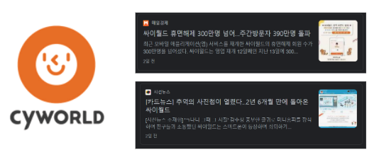

- 시대의 변화에 따른 비대면 서비스
- 기존의 타임캡슐은 인화한 사진이나 물건 등을 사용했으나 시대가 흘러감에 따라 컨텐츠들은 데이터화

▶ 현대사회에 어울리는 타임캡슐을 제공하고자 `기억함`을 개발

 

### **아키텍처**

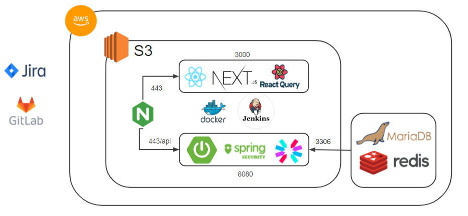

 

### **UI 설계**

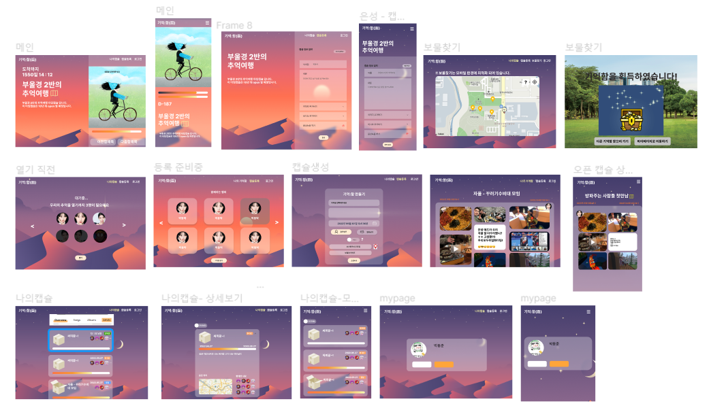

 

### **DB 설계**

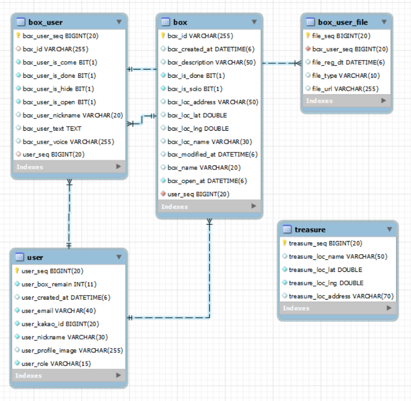

 

### **기능소개**

- 반응형 웹 디자인
- 글, 이미지, 비디오, 오디오 데이터 저장 가능
- 열리기 하루전 유저 이메일로 알림서비스 제공
- 보물찾기 서비스를 통해 기억함 찾기

 

> 메인 페이지 (main)

| pc                              | mobile                                        |
| ------------------------------- | --------------------------------------------- |
| 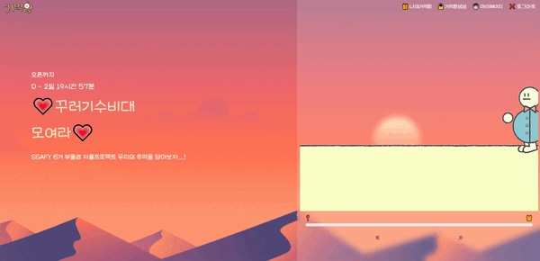 | 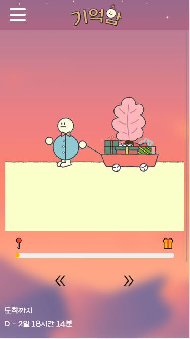 |

- 유저는 진행중인 기억함 상세정보와 시간의 흐름에 따른 이미지를 확인할 수 있습니다.
- 이미지 하단 `<< >>` 화살표를 클릭하여 다음 진행중인 기억함으로 넘어갈 수 있습니다.

 

> 기억함 생성 페이지 (create)

| pc                                | mobile                                          |
| --------------------------------- | ----------------------------------------------- |
| 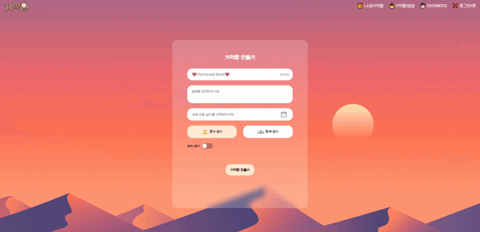 | 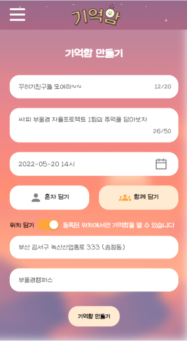 |

- 기억함을 생성하는 페이지입니다.
- 제목, 설명, 오픈날짜, 인원 정보는 필수로 작성해야합니다.
- 위치선택을 할 경우, 오픈날짜에 해당 위치 `100m이내`에서 기억함을 열어 볼 수 있습니다.

 

> 기억 등록 페이지 (register)

| pc                                  | mobile                                            |
| ----------------------------------- | ------------------------------------------------- |
|  | 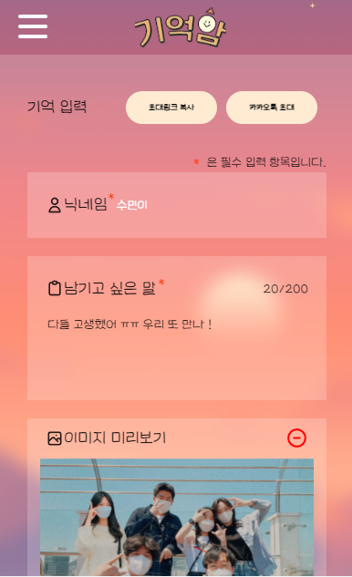 |

- 기억함을 생성하고 기억을 담는 페이지입니다.
- 기억함에서 사용할 닉네임과 텍스트기억은 필수로 작성해야합니다.
- 사진, 동영상, 음성메시지도 기억으로 담을 수 있습니다.
- 기억함을 생성 할 때 `그룹`을 선택했으면 친구들을 `링크` 또는 `카카오톡 공유하기`로 초대할 수 있습니다.
- 기억 등록을 할 경우 자신의 보유 기억함이 줄어듭니다.

 

> 내 기억함 페이지 (mybox)

| pc                               | mobile                                         |
| -------------------------------- | ---------------------------------------------- |
| 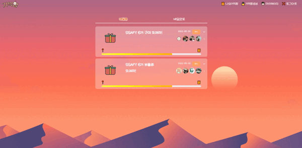 | 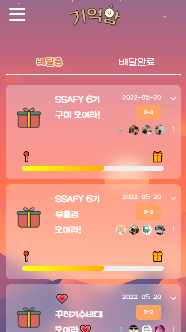 |

- 사용자의 기억함 리스트를 확인할 수 있는 페이지입니다.
- 기억함의 상세정보와 함께하는 유저를 확인할 수 있습니다.
- 배달중 카테고리에서 준비중, 진행중인 기억함 리스트를 확인할 수 있습니다.
- 배달완료 카테고리에서 오픈한 기억함 리스트를 확인할 수 있습니다.
- 숨기기를 클릭하면 해당 기억함을 목록에서 지울 수 있습니다.

 

> 준비 페이지 (ready)

| pc                               | mobile                                         |
| -------------------------------- | ---------------------------------------------- |
| 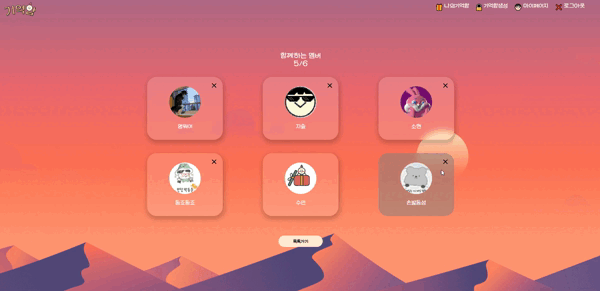 | 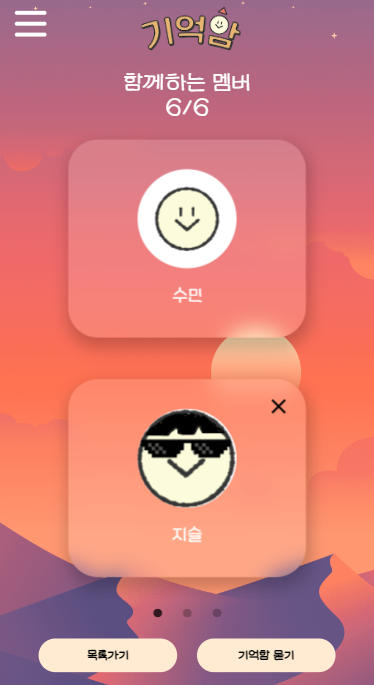 |

- 기억함을 묻기 전 유저 대기 페이지입니다.
- 초대된 유저리스트를 확인할 수 있고, 유저가 기억을 저장했는지 상태를 확인할 수 있습니다.
- 기억함을 만든 방장은 유저를 삭제할 수 있습니다.
- 해당 기억함을 참여한 모든 유저가 기억을 담았으면 방장만 기억함을 묻을 수 있습니다. 묻은 다음 오픈날짜까지 디데이가 시작됩니다.

 

> 오픈 페이지 (open)

| pc                              | mobile                                        |
| ------------------------------- | --------------------------------------------- |
| 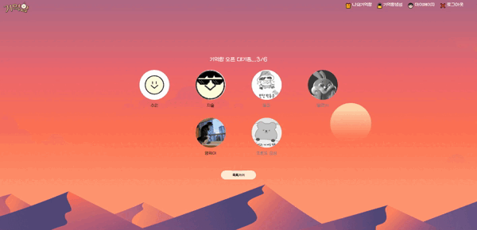 | 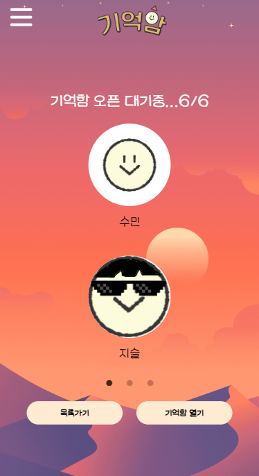 |

- 오픈날짜 이후에 유저들이 오픈 대기하는 페이지입니다.
- 그룹인 경우 유저의 `60%` 이상 참여하면 기억함을 오픈할 수 있습니다.
- 장소선택 ❌
  - 오픈 페이지에 들어오면 유저는 `참여상태`로 변경됩니다.
- 장소선택 ⭕
  - 오픈 페이지에 들어오면 유저의 위치와 기억함 위치를 비교하여 `100m이내`에 있으면 `참여상태`로 변경됩니다.
  - 참여하기를 실패한 경우 준비하기 버튼을 통해 위치확인을 재시도합니다.

 

> 상세보기 페이지 (box)

| pc                             | mobile                                       |
| ------------------------------ | -------------------------------------------- |
|  | 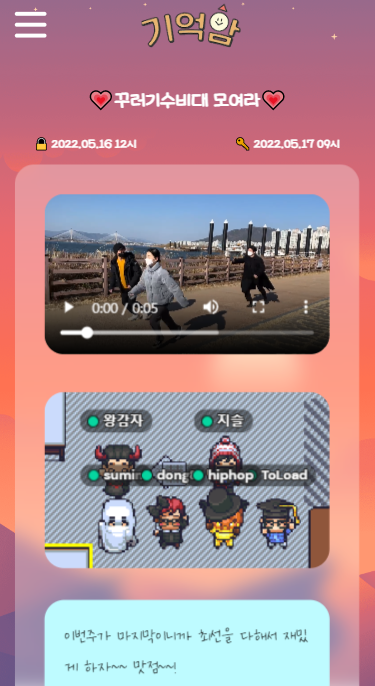 |

- 기억함의 모든 기억들을 확인할 수 있는 페이지입니다.
- 장소선택을 한 경우 지도를 확인할 수 있습니다.
- 텍스트, 동영상, 사진, 음성메시지를 랜덤하게 확인할 수 있습니다.

 

> 마이 페이지 (mypage)

| pc                                | mobile                                          |
| --------------------------------- | ----------------------------------------------- |
| 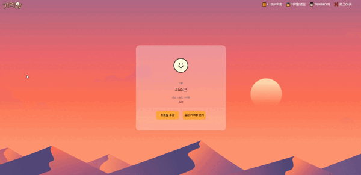 | 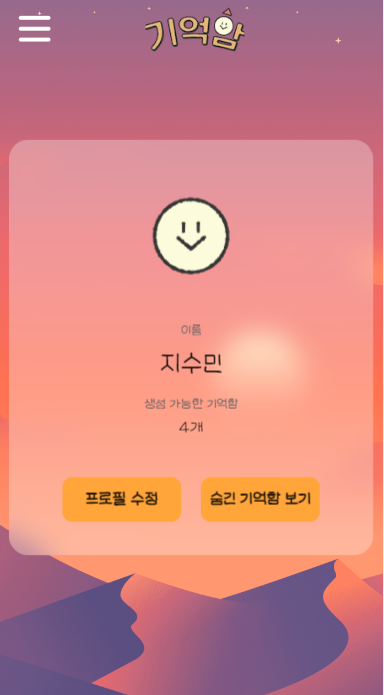 |

- 유저 정보를 확인할 수 있는 페이지입니다.
- 유저는 프로필 사진을 변경, 회원탈퇴가 가능합니다.
- 내기억함페이지에서 숨긴 기억함을 확인, 보이기를 할 수 있습니다.

 

> 보물찾기 페이지 (treasure)

| pc                                  | mobile                                            |
| ----------------------------------- | ------------------------------------------------- |
|  |  |

- 유저가 획득할 수 있는 기억함의 위치를 표시해주는 페이지입니다.
- 각 마커들이 표시하는 장소는 우리나라 공공시설 좌표 데이터를 기반으로 지정했습니다.
- 실시간으로 유저의 위치를 추적할 수 있습니다.
- 처음 사용하는 유저를 위해 사용 설명서를 제공합니다.
- 지도의 마커와 사용자의 거리가 50m 이내일때, 마커를 클릭하면 ar 기능이 활성화 됩니다.
- 활성화된 AR 화면에서는 해당 공공 시설 좌표를 기반으로 보물상자가 띄워지게 됩니다.
- 띄워진 보물상자를 터치 혹은 클릭한다면 상자가 열리는 애니메이션과 함께 기억함의 갯수가 1 추가됩니다.
- 한번 얻어진 보물상자는 지도에서 사라지며, 중복획득이 불가능하게 처리되었습니다.

 

## **산출물**

[기능명세서](https://docs.google.com/spreadsheets/d/15htQ4n-Jpeju2OZB5ldeIp7YWkkQ8Z--/edit#gid=1181581752)

[API](https://docs.google.com/spreadsheets/d/15htQ4n-Jpeju2OZB5ldeIp7YWkkQ8Z--/edit#gid=1198128522)
